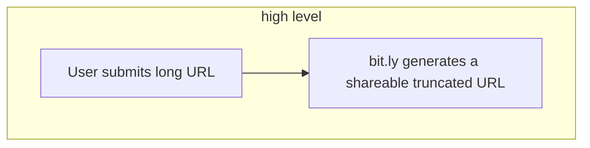
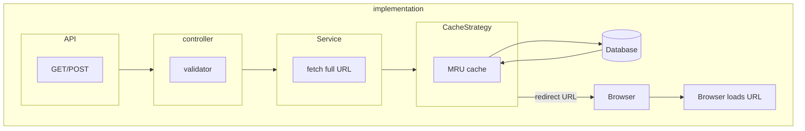

# bit.ly System Design Diagram

```mermaid

flowchart TD
subgraph high level
A[User submits long URL]
bitly[bit.ly generates a shareable truncated URL]
A --> bitly
end
```

```mermaid
flowchart TD

subgraph implementation
    subgraph API
        method[GET/POST]
    end

    subgraph Service
        fetch[fetch full URL]
    end

    subgraph CacheStrategy
        mru[MRU cache]
    end

    db[(Database)]

    subgraph controller
        validator
    end
    API --> controller
    controller --> Service
    Service --> CacheStrategy
    mru --> db
    db --> mru
    CacheStrategy -- redirect URL --> Browser

    Browser --> Z[Browser loads URL]
end
```
